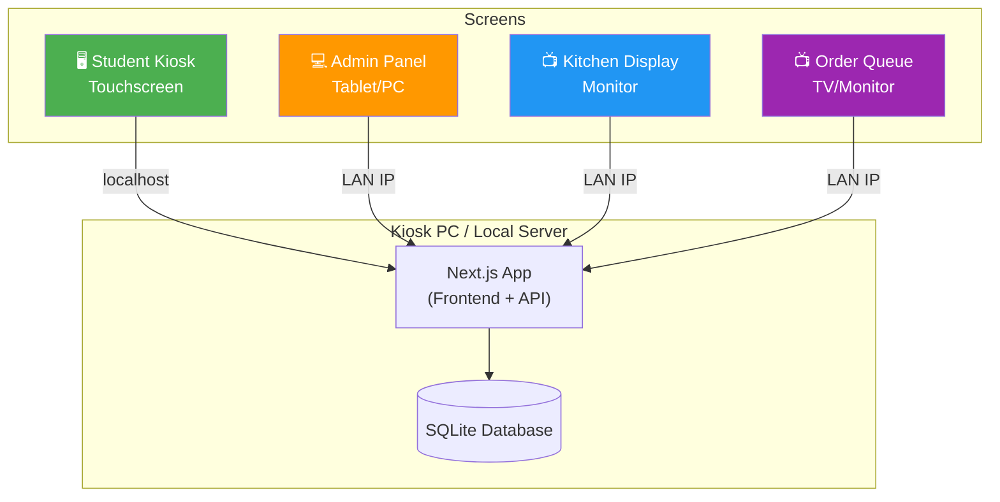
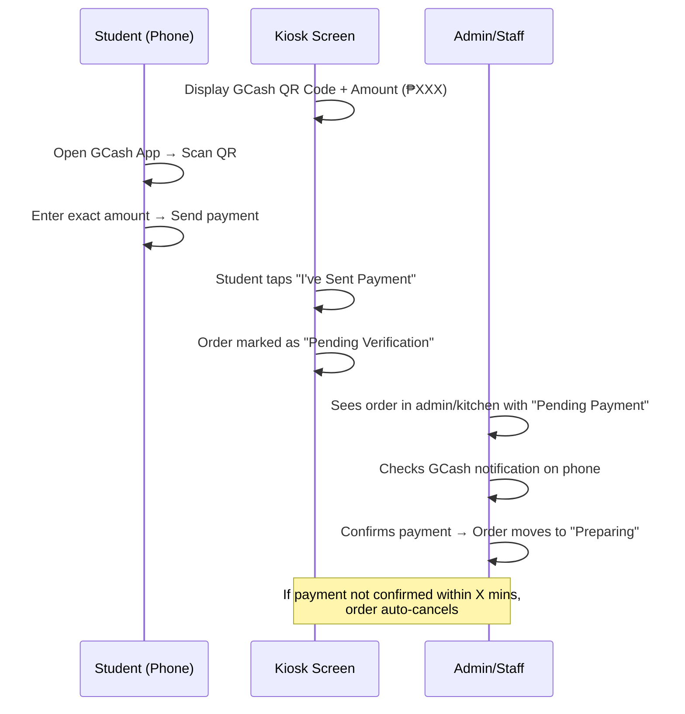
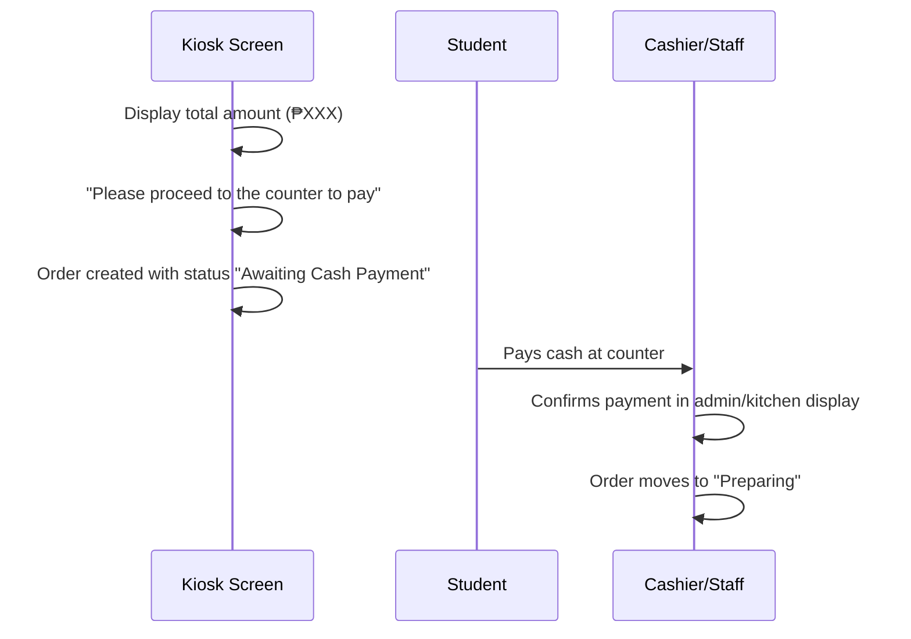
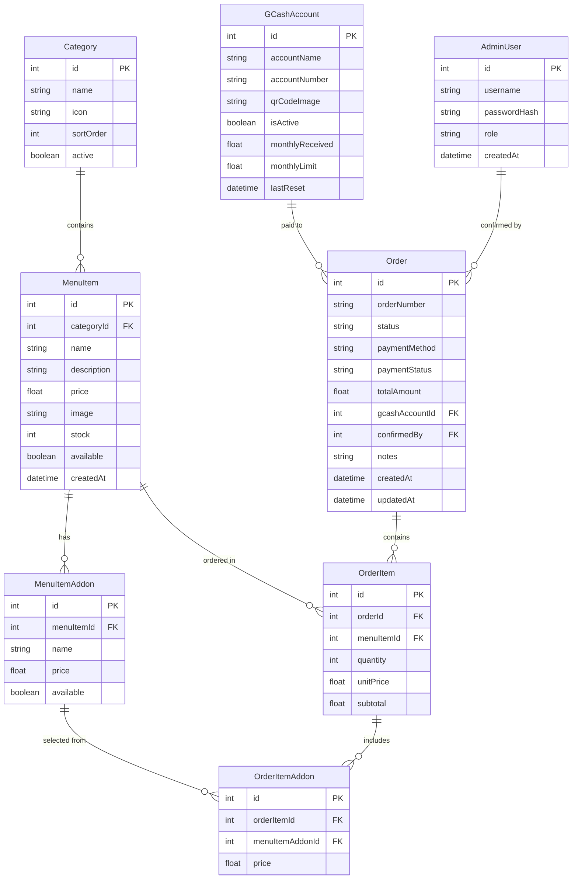

# University Canteen Kiosk System

A full-stack touchscreen kiosk application for a university canteen — enabling students to browse menus, order food, and pay via Cash or GCash QR.

## Recommended Tech Stack

After researching options, here's what I recommend and why:

### Frontend & Backend: **Next.js 14+ (App Router)**
| Concern | Why Next.js |
|---|---|
| **Speed** | Server-side rendering for instant page loads on the kiosk touchscreen |
| **Unified codebase** | API routes handle the backend — no separate server to deploy |
| **Multiple screens** | Different route groups for kiosk, admin, kitchen display, and queue |
| **Security** | Middleware-based auth protects admin routes; server components keep secrets server-side |
| **DX** | TypeScript, hot reload, massive ecosystem |

### Database: **SQLite + Prisma ORM**
| Concern | Why SQLite + Prisma |
|---|---|
| **Simplicity** | No external database server — single file, zero config |
| **Performance** | Blazing fast reads for menu browsing; more than enough for a single-location canteen |
| **Type safety** | Prisma gives us auto-generated types and migrations |
| **Portability** | Easy to backup, move, or swap to PostgreSQL later via Prisma |

### Deployment: **Local machine / kiosk PC**
- The Next.js app runs on the kiosk PC itself (or a dedicated server on the LAN)
- The kiosk touchscreen opens Chrome/Edge in **kiosk mode** (`--kiosk` flag) pointing to `localhost`
- Admin panel and kitchen display connect via the local network IP
- No cloud hosting costs

### UI Libraries
- **Vanilla CSS** with CSS custom properties (design tokens) for a premium, custom look
- **Lucide React** for icons
- **Google Fonts** (Inter / Outfit) for modern typography
- **Framer Motion** for smooth touch animations

---

## System Architecture



---

## Screen Breakdown

### 1. 🖥️ Student Kiosk (Touchscreen)

The primary ordering interface. Optimized for touch with large tap targets, smooth animations, and an intuitive flow.

| Screen | Description |
|---|---|
| **Welcome** | Branded splash with "Tap to Order" CTA. Idle animation/screensaver after timeout. |
| **Menu Browse** | Category tabs (Rice Meals, Snacks, Drinks, etc.) + item grid with images & prices |
| **Item Detail** | Large image, description, add-ons/variations, quantity selector, "Add to Cart" |
| **Cart** | Order summary, item editing, subtotal/total, "Place Order" button |
| **Payment Select** | Choose between Cash and GCash with large, clear buttons |
| **GCash Payment** | Displays QR code + exact amount to pay. Instructions: "Scan → Pay → Tap Confirm" |
| **Cash Payment** | Shows total amount. Instructions: "Please pay ₱XXX at the counter" |
| **Order Confirmed** | Order number, estimated wait time, animated confirmation |
| **Idle/Screensaver** | Auto-returns to welcome after configurable timeout |

### 2. 💻 Admin Panel (Protected)

Accessible from any device on the network. Password-protected with session management.

| Section | Description |
|---|---|
| **Dashboard** | Today's sales, order count, popular items, revenue chart |
| **Menu Management** | CRUD for categories and food items (name, description, price, image, availability) |
| **Inventory** | Stock levels, low-stock alerts, quantity adjustments |
| **Order Management** | View all orders, filter by status/date, manual status updates |
| **GCash Config** | Primary & backup GCash accounts (name, number, QR image). Toggle active account. Monthly limit tracking. |
| **Settings** | Kiosk branding, idle timeout, receipt messages, operating hours |
| **User Management** | Admin accounts (for multi-staff access) |

### 3. 📺 Kitchen Display System (KDS)

Real-time order queue for kitchen staff. Auto-refreshes.

| Feature | Description |
|---|---|
| **Order Cards** | Incoming orders shown as cards with order number, items, special notes |
| **Status Flow** | New → Preparing → Ready → Completed (tap to advance) |
| **Sound Alert** | Audio notification for new orders |
| **Priority View** | Oldest orders highlighted, color-coded by wait time |
| **Auto-archive** | Completed orders slide off after configurable delay |

### 4. 📺 Order Queue Display (Student-Facing)

A TV/monitor near the counter showing order status to students.

| Feature | Description |
|---|---|
| **Now Preparing** | List of order numbers currently being made |
| **Ready for Pickup** | Highlighted order numbers with animation/sound |
| **Completed** | Recently completed orders (faded) |
| **Auto-scroll** | Cycles through orders when list is long |

---

## GCash Payment Flow (No API)

Since GCash API access requires enterprise partnership, we use a **manual QR + staff confirmation** approach:



### GCash Account Rotation
- Admin configures **multiple GCash accounts** (primary + backups)
- Each account tracks estimated monthly received amount
- When an account approaches the monthly limit (~₱100K for personal), the system **automatically switches** to the next backup account
- Admin can manually toggle accounts or reset counters monthly

> [!IMPORTANT]
> **Manual Verification Required**: Since there's no API, a staff member must verify each GCash payment by checking the GCash app notification on the registered phone. The kiosk marks the order as "Pending Verification" until staff confirms.

---

## Cash Payment Flow



---

## Database Schema (Prisma)



---

## Proposed File Structure

```
CanteenKiosk/
├── prisma/
│   └── schema.prisma              # Database schema
│   └── seed.ts                    # Seed data (sample menu items)
├── public/
│   ├── fonts/                     # Google Fonts (offline)
│   ├── images/                    # Menu item images, branding
│   └── sounds/                    # Notification sounds
├── src/
│   ├── app/
│   │   ├── layout.tsx             # Root layout
│   │   ├── page.tsx               # Redirect to /kiosk
│   │   │
│   │   ├── (kiosk)/               # Student kiosk route group
│   │   │   ├── layout.tsx         # Kiosk layout (fullscreen, no nav)
│   │   │   ├── page.tsx           # Welcome/splash screen
│   │   │   ├── menu/page.tsx      # Menu browsing
│   │   │   ├── cart/page.tsx      # Cart review
│   │   │   ├── payment/page.tsx   # Payment method + GCash/Cash flow
│   │   │   └── confirmed/page.tsx # Order confirmation
│   │   │
│   │   ├── (admin)/               # Admin route group (protected)
│   │   │   ├── layout.tsx         # Admin layout (sidebar nav)
│   │   │   ├── login/page.tsx     # Admin login
│   │   │   ├── dashboard/page.tsx # Dashboard
│   │   │   ├── menu/page.tsx      # Menu management
│   │   │   ├── inventory/page.tsx # Inventory
│   │   │   ├── orders/page.tsx    # Order management
│   │   │   ├── gcash/page.tsx     # GCash configuration
│   │   │   └── settings/page.tsx  # System settings
│   │   │
│   │   ├── kitchen/               # Kitchen display
│   │   │   └── page.tsx
│   │   │
│   │   ├── queue/                 # Student-facing order queue
│   │   │   └── page.tsx
│   │   │
│   │   └── api/                   # API routes
│   │       ├── auth/
│   │       ├── categories/
│   │       ├── menu-items/
│   │       ├── orders/
│   │       ├── gcash/
│   │       └── settings/
│   │
│   ├── components/
│   │   ├── kiosk/                 # Kiosk-specific components
│   │   ├── admin/                 # Admin-specific components
│   │   ├── kitchen/               # Kitchen display components
│   │   └── shared/                # Shared UI components
│   │
│   ├── lib/
│   │   ├── prisma.ts              # Prisma client singleton
│   │   ├── auth.ts                # Authentication helpers
│   │   └── utils.ts               # Utility functions
│   │
│   └── styles/
│       └── globals.css            # Global styles + design tokens
│
├── package.json
├── tsconfig.json
├── next.config.js
└── .env                           # Environment variables
```

---

## User Review Required

> [!IMPORTANT]
> ### Tech Stack Confirmation
> I'm recommending **Next.js + SQLite + Prisma** for simplicity and performance. This means:
> - Everything runs on a single machine (the kiosk PC)
> - No cloud hosting or external database server needed
> - All screens connect over your local network
> 
> **Alternative**: If you expect multiple canteen branches or need cloud access, we could use **PostgreSQL + cloud hosting** instead. Let me know your preference.

> [!WARNING]
> ### GCash Limitation
> Without API access, GCash payments require **manual staff verification**. The flow is:
> 1. Kiosk shows QR code + amount
> 2. Student pays via phone
> 3. Student taps "I've paid" on kiosk
> 4. Staff checks their GCash phone notification and **manually confirms** in the system
> 
> This means there will be a short delay for GCash orders. Is this acceptable, or would you like to explore alternative payment verification methods?

> [!IMPORTANT]
> ### Your Existing Designs
> You mentioned having HTML designs and images. **Please drop them into the `CanteenKiosk` folder** so I can incorporate your visual language into the implementation. I'll adapt the color scheme, layout patterns, and branding from your designs.

---

## Open Questions

1. **Deployment hardware**: What kind of touchscreen/PC will the kiosk run on? (This affects performance optimization)
2. **Number of kiosks**: Will there be just one kiosk, or multiple? (Affects database concurrency design)
3. **Printing**: Do you need receipt printing? If so, do you have a thermal printer model in mind?
4. **Menu complexity**: How many categories and items roughly? Do items have variants (e.g., Regular/Large) or just add-ons?
5. **Operating hours**: Should the kiosk automatically disable ordering outside operating hours?
6. **Branding**: University/canteen name, colors, and logo to use?

---

## Phased Development Plan

### Phase 1 — Foundation & Kiosk Core
- Project setup (Next.js, Prisma, SQLite, design system)
- Database schema + seed data
- Welcome screen with idle/screensaver
- Menu browsing (categories + items grid)
- Item detail + add to cart
- Cart management
- Basic order placement

### Phase 2 — Payments & Order Flow
- Payment method selection (Cash / GCash)
- GCash QR display with amount + account rotation
- Cash payment flow
- Order confirmation screen with order number
- Order status tracking

### Phase 3 — Admin Panel
- Admin login + session management
- Dashboard with sales stats
- Menu CRUD (categories + items)
- Inventory management
- Order management + payment verification
- GCash account configuration

### Phase 4 — Kitchen & Queue Displays
- Kitchen Display System with real-time updates
- Order status management (preparing → ready)
- Student-facing queue display
- Sound notifications

### Phase 5 — Polish & Deployment
- Idle timeout + screensaver
- Touch animations and micro-interactions
- Error handling + offline resilience
- Performance optimization
- Kiosk mode setup guide

---

## Verification Plan

### Automated Tests
- API endpoint testing with sample data
- Order flow integration test (create → pay → prepare → complete)
- GCash account rotation logic tests

### Manual Verification
- Full ordering flow test on a touchscreen (or simulated touch)
- Admin panel CRUD operations
- Kitchen display real-time updates
- GCash payment simulation
- Multi-device access over LAN
- Browser kiosk mode testing
